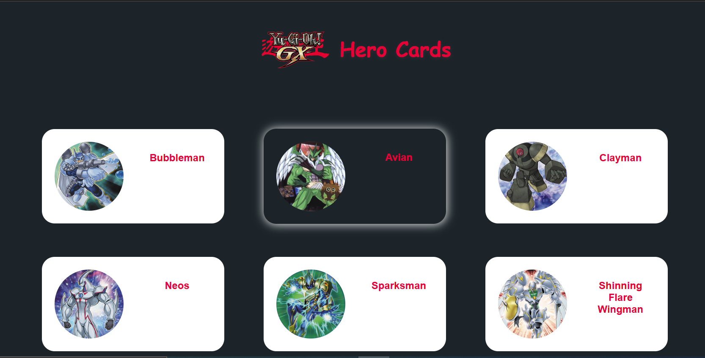

**Month 2-Week 2**

Action item 1: Fetch data from an API and dynamically render UI.

- I continued with the Yu-gi-oh cards and got this api endpoint https://db.ygoprodeck.com/api/v7/cardinfo.php to fetch data for my cards.
- I also decided to set up a modal to display card details for each character card clicked

Action item 2: Expand error handling on your web page(s). Consider the user experience for such cases as data fetching failures, lost network connection, etc.

- I learnt how to handle exceptions for when there is a lost of connection so i included a simple error message for that.
- I also caught exceptions for invalid data and when a data is not available, or for an invalid fetch.

**General Improvements**

-Improved structure and maintainability of code
-Integrated card modal functionality and improved profile detail card handling
-Refactor CSS for enhanced styling and responsiveness

[Month2-Week2](https://github.com/VictorOkpare/Technest-project/tree/main/Assignments/Month2-Week2)

**Month 2-Week 1 **
 Action Items 1: Update your webpages to dynamically render UI from a JSON file .

 Here are the steps i took to dynamically render data from the Json file.

* - I Created a folder "data" in my assets folder to store static data
  - I converted the herodetails array of the Week4 task to  Json data and created the heroDetails.json file
  - I defined an async function to fetch data from the json file which returned a promise
  - I created heroDetails variable to hold the fetchData() function
  - I converted the createHeroCards() and profileHerocard() functions to async function because heroDetails  now returns a promise and needs to be resolved first.

  Action item 2 (Optional) - Add error handling to your web page(s). Consider the user experience for such cases as an invalid file path, empty data, invalid data, etc.

  Errors handled

- Fetch fuction data errors: I used the try catch block in the execution of the fetch data function to catch errors that may occur in fetching the data like an incorrect file path or if the .json()method encounters an invalid JSON data. it would fail so the catch block will also catch this error and display an error in the console and also send an error message on the HTML container

- Empty Data Error: If I have an empty array the if statement in my try block will run and will display an erro message in my HTML container.

- Index Error: In my profilecard section I handled errors that could occur from the heroIndex. The heroIndex is assigned to every card when the heroDetails is been mapped through from the json data. This index is used in the profilecard section to match the heroCard that was clicked and the data of the hero in the heroDetails then the data is rendered on the Hero Profile Card. I used the try-catch block to check if the heroIndex is valid, and for every invalid heroIndex I return an message to the HTML container

**Week 4**

* Action-item:Update your webpages to display static data from a Javascript file, instead of the data being hardcoded in the HTML file *

**Steps**
* - Defined an array of object to store static data for each hero character

- Used querySelector to select the element where the data should be rendered

- Utilized the map() function to generate hero cards dynamically

- Used the URLSearchParams to retrieve the Hero index from the Hero card page

- Utilized the parseInt() to ensure the index passed is an integer data type

- Continued with the styles that was used in the previous task

Here is a demo

